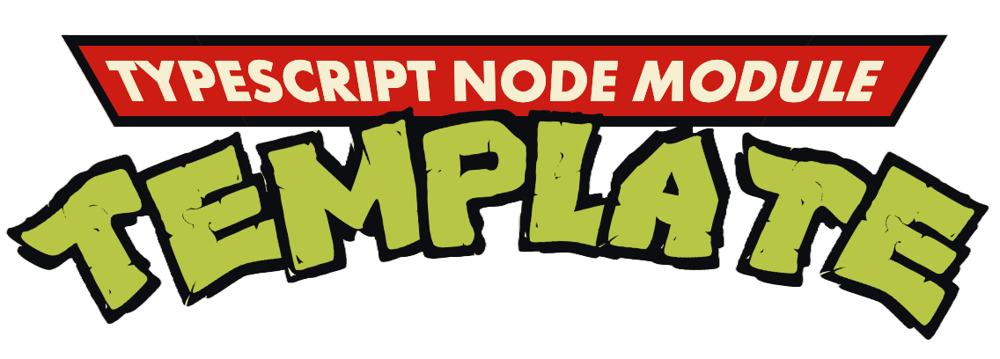

Lllama node cpp wrapper using Llama3 underneath.

# USE

Follow these steps to make it yours:

1. Install module:

```sh
npm i llama-gen-post
```

Or

```sh
pnpm i llama-gen-post
```

Or

```sh
yarn add llama-gen-post
```

2. Add your GGUF model path in a .env file at the root of your project:

```sh
LLAMA_MODELS_LOCATION=/Users/me/example/models/
LLAMA_MODEL_NAME=Meta-8b.gguf
```

3. Sample chat-like usage:

```ts
import { session, type ChatHistoryItem } from 'llama-gen-post';
import readline from 'readline';
import { spawn } from 'node:child_process';

const rl = readline.createInterface({
  input: process.stdin,
  output: process.stdout,
});

const run = async () => {
  console.log(`# START LLAMA CHAT`);
  console.log(`\n`);

  console.log(`# Feeding history traces`);
  const history: ChatHistoryItem[] = [
    { type: 'user', text: 'Hey.' },
    { type: 'model', response: ['Hello !'] },
  ];

  console.log(`# Waiting seat allocation`);
  const session = await _session(
    'You are an assistant, you speak in english, you must be concise and helpfull.',
    history,
  );

  console.log(`# Prompt ready`);

  console.log(`# Activated TTS (voice)`);

  console.log(`\n`);
  rl.setPrompt('1 > ');
  rl.prompt();
  let i = 1;

  rl.on('line', async (q) => {
    if (!q || q === '' || q === 'exit' || q === 'quit' || q === 'q') {
      rl.close();
    } else {
      const a = await session.prompt(q);
      console.log(`${i} @ ${a}`);
      spawn('say', [a]);
      console.log(`\n`);
      i++;
    }
    rl.setPrompt(`${i} > `);
    rl.prompt();
  }).on('close', async () => {
    console.log(`\n`);
    console.log(`Disposing session...`);
    session.dispose();

    console.log(`\n`);
    const a = session.getChatHistory();
    console.log(`History @ ${JSON.stringify(a)}`);

    console.log(`\n`);
    console.log('# END LLAMA CHAT');

    process.exit(0);
  });
};

run();
```
