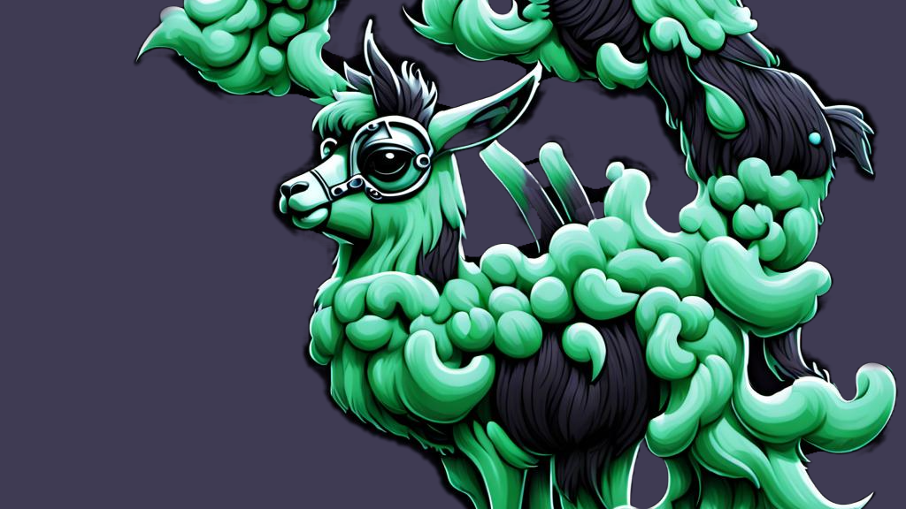

Lllama node cpp wrapper using Llama3 underneath.

# BUILDING FROM SOURCE

By following the steps below, you can build and install the module from source code.

1. Clone the repository:

```sh
git clone https://github.com/tib0/llama3-wrapper.git
```

2. Install dependencies:

```sh
cd ./llama3-wrapper
pnpm i
```

3. Build the module:

```sh
pnpm build
```

4. Link the module globally:

```sh
pnpm link -g
```

5. In the target project folder use the module:

```sh
cd /path/to/target-project
pnpm link -g llama3-wrapper
```

# CONFIGURATION

Add your GGUF model path in a .env file at the root of your project:

```sh
LLAMA_MODELS_PATH=/Users/me/example/LLM/Models/my-model-file.gguf
```

# SAMPLES USAGE

- Sample chat-like usage in terminal:

```ts
import { type ChatHistoryItem, LlamaWrapper } from 'llama3-wrapper';
import readline from 'readline';
import { spawn } from 'node:child_process';

const rl = readline.createInterface({
  input: process.stdin,
  output: process.stdout,
});

const run = async () => {
  console.log(`# START LLAMA CHAT`);
  console.log(`\n`);

  console.log(`# Feeding history traces`);
  const history: ChatHistoryItem[] = [
    { type: 'user', text: 'Hey.' },
    { type: 'model', response: ['Hello !'] },
  ];

  console.log(`# Waiting seat allocation`);

  const llamaNodeCPP = new LlamaWrapper();
  await llamaNodeCPP.loadModule();
  await llamaNodeCPP.loadLlama();
  await llamaNodeCPP.loadModel(process.env.LLAMA_MODELS_PATH);
  await llamaNodeCPP.initSession(promptSystem);
  console.log(`# Prompt ready`);

  console.log(`# Activated TTS (voice)`);

  console.log(`\n`);
  rl.setPrompt('1 > ');
  rl.prompt();
  let i = 1;

  rl.on('line', async (q) => {
    if (!q || q === '' || q === 'exit' || q === 'quit' || q === 'q') {
      rl.close();
    } else {
      const a = await llamaNodeCPP.prompt(q);
      console.log(`${i} @ ${a}`);
      spawn('say', [a]);
      console.log(`\n`);
      i++;
    }
    rl.setPrompt(`${i} > `);
    rl.prompt();
  }).on('close', async () => {
    console.log(`\n`);
    console.log(`Disposing session...`);
    await llamaNodeCPP.disposeSession();
    console.log(`\n`);
    const a = await llamaNodeCPP.getHistory();
    console.log(`History:`);
    console.log(JSON.stringify(a));

    console.log(`\n`);
    console.log('# END LLAMA CHAT');

    process.exit(0);
  });
};

run();
```
